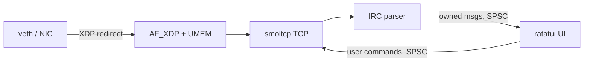

# Rustssi Spec

This is the technical spec for the client described in `intent.md`. Intent gives
the goals and the order of work; this document pins the contracts each stage has
to satisfy so the data plane can be built without re-litigating architecture
partway through.

## Architecture

Two threads and nothing else. A **data-plane thread** is pinned to a dedicated
CPU and owns everything from the wire up through IRC parsing: it busy-polls the
AF_XDP socket, drives smoltcp, and turns the reassembled byte stream into IRC
messages. A **UI thread** owns the terminal: it renders with ratatui and reads
keyboard input. The two communicate over a pair of single-producer /
single-consumer ring buffers — decoded messages flow up to the UI, user commands
flow back down to the data plane. There is no async runtime anywhere; the
data-plane thread spins, and the UI thread runs a timed poll loop.

Borrows into the reassembled stream survive all the way through parsing. The one
deliberate copy on the hot path is at the SPSC boundary: a value crossing to the
UI thread must be `Send`, so each decoded message is copied into an owned form as
it is enqueued. IRC lines are at most 512 bytes, and this copy lands exactly
where intent says copying becomes acceptable — the handoff to the UI.

## Data plane

The eBPF program is written in C and loaded from Rust through libbpf-rs. It
attaches in generic (SKB) XDP mode on the dev interface.

A BPF hash map holds the endpoints we care about, keyed by an `(IPv4, port)`
tuple. For every packet the program checks whether *either* endpoint — source or
destination — is present in the map. If so, the packet is redirected into an
`XSKMAP` and delivered to our AF_XDP socket; if neither endpoint matches, the
program returns `XDP_PASS` and the packet takes the normal kernel path. Matching
both directions is what lets us see the full TCP conversation.

The AF_XDP socket binds with `XDP_USE_NEED_WAKEUP`, and the data-plane thread
enables `SO_PREFER_BUSY_POLL` so it can spin on the RX ring instead of paying for
interrupts and syscalls. The bind mode is the only thing that differs between dev
and production: on veth we bind `XDP_COPY` (veth has no AF_XDP zero-copy path, so
the kernel copies each frame into UMEM), and on a zero-copy-capable NIC later we
bind `XDP_ZEROCOPY` and the NIC DMAs straight into UMEM. The userspace code —
UMEM, rings, XSKMAP, smoltcp — is byte-for-byte identical either way, so the
veth harness proves correctness while real hardware delivers the zero-copy
ingress the project is named for.

UMEM layout:

- Frame size: 4096 bytes.
- Frame count: 4096 (16 MiB region).
- Fill ring / RX ring: 2048 entries each.
- Completion ring / TX ring: 2048 entries each.

The data-plane thread is pinned with `sched_setaffinity` (via `core_affinity`).
Deployment may additionally isolate that core with `isolcpus` / `nohz_full`, but
that is a runtime concern, not code.

## Userspace TCP (smoltcp)

smoltcp runs TCP over the UMEM frames. We implement smoltcp's `Device` trait so
its `RxToken` reads out of a filled UMEM frame and its `TxToken` writes into a
UMEM frame handed to the TX ring. smoltcp owns its own socket buffers, so there
is one unavoidable copy here — UMEM frame into the smoltcp RX buffer — and from
that buffer onward everything is a borrow.

The first cut handles exactly one TCP connection: the socket opens to the
configured server on port 6667, completes the handshake, and exposes the
reassembled inbound byte stream to the parser. Outbound bytes produced by the
parser/command path are written back through the socket's send buffer.

## Message parsing

IRC messages are framed on `CRLF`. The parser reads complete lines out of the
reassembled stream and produces a borrowed message view — optional prefix,
command, parameters, and trailing parameter — pointing into smoltcp's RX buffer
rather than allocating.

The first cut understands the commands needed to register and hold a
conversation:

- `PING` / `PONG` (keepalive).
- `NICK` / `USER` (registration).
- `PRIVMSG` (send and receive chat).
- `JOIN` (enter a channel).
- `NOTICE` (server/user notices).
- Registration and channel numerics: `001` welcome, `353` / `366` names list,
  `433` nick-in-use, and any other `4xx` / `5xx` shown to the user raw.

Anything else is passed through as a raw line rather than dropped, so nothing is
silently lost.

## Threading and event model

**Data-plane thread (pinned).** Busy-polls the AF_XDP RX ring, drives smoltcp's
`poll`, frames and parses inbound IRC messages, and pushes an owned copy of each
into the inbound SPSC ring. On the same turn it drains the outbound SPSC ring of
user commands, encodes them, and hands them to smoltcp's send buffer.

**UI thread.** Runs a `crossterm::event::poll(timeout)` loop. Each iteration it
drains the inbound ring with `try_recv`, folds new messages into UI state,
handles any terminal input, pushes resulting user commands onto the outbound
ring, and redraws when either source produced a change.

The two rings are lock-free SPSC (`rtrb`). One producer and one consumer on each,
so no locking and no contention.

## UI

ratatui in an alternate screen. A scrollback view of the current channel's
message history above a single-line input field. Redraw is driven by the UI
thread's poll loop — on new messages, on input, and on resize.

## Configuration and privileges

Startup configuration supplies the server address and port, the nick, and the
channels to join; the server's `(IPv4, port)` is inserted into the BPF config map
before the socket connects.

Loading the XDP program, creating the AF_XDP socket, and mmap-ing UMEM require
`CAP_NET_ADMIN` and `CAP_NET_RAW` (run as root or grant the binary those
capabilities with `setcap`).

## Test harness

A network namespace with a veth pair provides a reproducible target with no
special hardware. `ngircd` runs inside the namespace as a plaintext ircd on port
6667. The XDP program attaches to the veth endpoint in generic mode, and the
config map is populated with the ircd's `(IPv4, 6667)`.

## Build phases and acceptance

1. **Data plane up.** netns + veth + the eBPF redirect into the `XSKMAP`.
   *Done when* a raw AF_XDP consumer observes matched frames arriving in UMEM
   while unmatched traffic still reaches the kernel.
2. **TCP up.** smoltcp over UMEM opens a connection to the local `ngircd` and
   completes IRC registration. *Done when* the client receives numeric `001`.
3. **Parser up.** The zerocopy parser turns the live stream into borrowed IRC
   messages. *Done when* it correctly parses a real session (`PING`, `JOIN`
   replies, `PRIVMSG`) with borrows validated against the RX buffer.
4. **UI up.** ratatui plus the two-thread event model. *Done when* the user can
   join a channel, see incoming `PRIVMSG` traffic, and send a `PRIVMSG` that a
   second client in the channel receives.
